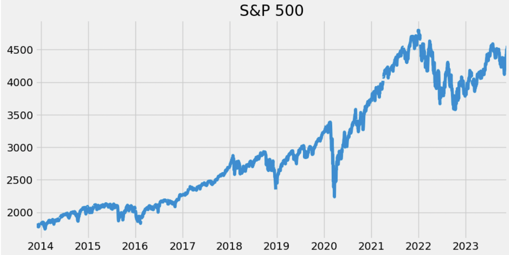
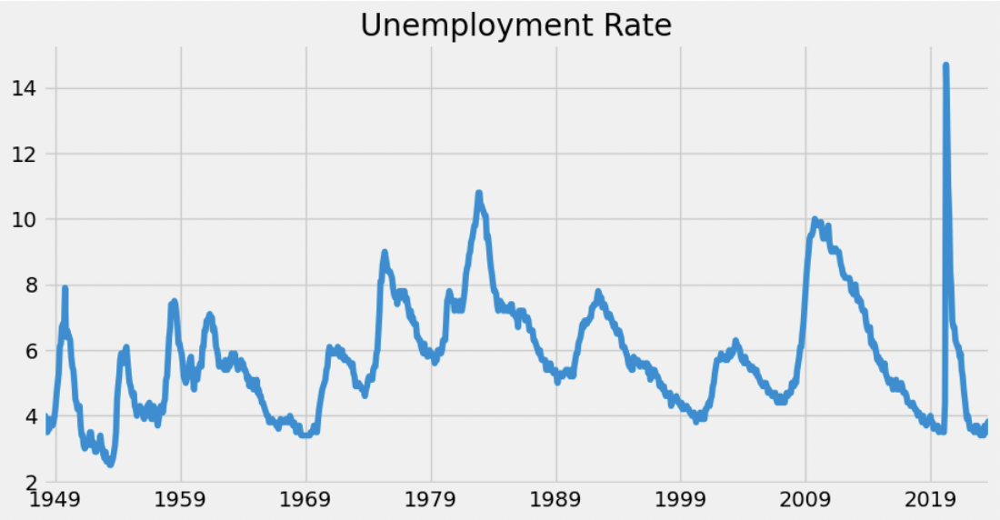

# Overview

The Fred API provides information about finances and employment in the USA. https://fred.stlouisfed.org/docs/api/fred/

The purpose of this software was to learn the basics of data analysis and to demonstrate my understanding.

[Software Demo Video](https://us06web.zoom.us/rec/share/e0nElyJL6GvDkxVtNRiC6Ywppqahxer4digWmaK5UiDEvEj__7IeEBziHlvNG0ck.4wjRrWP2H5rhNsaZ)

# Data Analysis Results

How was the S&P 500 affected by the Covid 19 Pandemic?: There was a sharp decrease in value during 2020, but it quickly recovered.

How was employment across the country affected by the Covid 19 Pandemic?: Unemployment sharply increased to record breaking heights. It quickly recovered the following year.

# Development Environment

I used Kaggle.com for it's great data analytics functionality.

The program is written in Python using the matplotlib library to produce the graphs.

# Useful Websites

{Make a list of websites that you found helpful in this project}

- [Rob Mulla Youtube](https://www.youtube.com/watch?v=R67XuYc9NQ4)
- [Fred](https://fred.stlouisfed.org/docs/api/fred/)
- [Kaggle](https://www.kaggle.com/)

# Future Work

- Separate employment data by state
